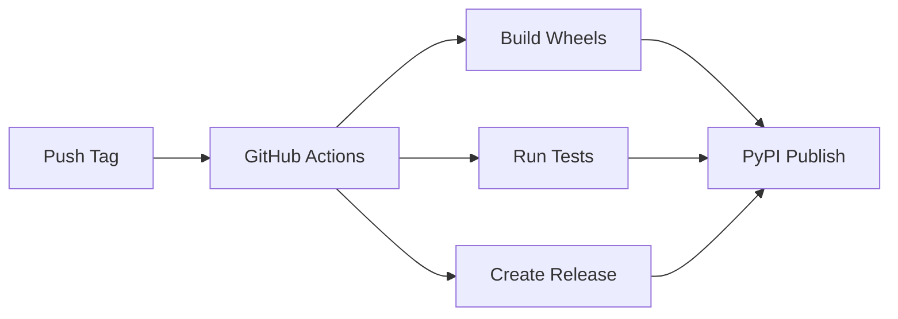

# 🚀 Contributing to Catzilla

Welcome to **Catzilla** - a high-performance Python web framework with C-accelerated routing! This comprehensive guide will take you from zero to hero in contributing to this professional-grade project.

## 📋 Table of Contents

- [🎯 Quick Start](#-quick-start)
- [🛠️ Environment Setup](#️-environment-setup)
- [🏗️ Development Workflow](#️-development-workflow)
- [📦 Version Management](#-version-management)
- [🚀 Release Process](#-release-process)
- [🧪 Testing Guidelines](#-testing-guidelines)
- [💡 Code Standards](#-code-standards)
- [📚 Documentation](#-documentation)
- [🚨 Troubleshooting](#-troubleshooting)
- [✨ Best Practices](#-best-practices)

---

## 🎯 Quick Start

> **⚠️ CRITICAL REQUIREMENT: Python Virtual Environment**
>
> You **MUST** use a Python virtual environment for Catzilla development. This is **non-negotiable** and prevents dependency conflicts that can break your system.

### 5-Minute Setup

```bash
# 1. Clone and setup
git clone https://github.com/rezwanahmedsami/catzilla.git
cd catzilla
git submodule update --init --recursive

# 2. Create virtual environment (REQUIRED!)
python -m venv venv
source venv/bin/activate  # macOS/Linux
# venv\Scripts\activate     # Windows

# 3. Install dependencies
pip install -r requirements-dev.txt

# 4. Build and test
./scripts/build.sh          # macOS/Linux
# scripts\build.bat         # Windows

# 5. Verify installation
python -c "import catzilla; print(f'✅ Catzilla {catzilla.__version__} ready!')"
```

---

## 🛠️ Environment Setup

### Prerequisites

#### Required Software
- **Python 3.8+** (3.10+ recommended)
- **CMake 3.15+**
- **Git** with submodule support
- **Compiler**:
  - **macOS**: Xcode Command Line Tools (`xcode-select --install`)
  - **Linux**: GCC 7+ or Clang 8+ (`sudo apt install build-essential`)
  - **Windows**: Visual Studio 2019+ or Build Tools

#### System-Specific Setup

**macOS:**
```bash
# Install Xcode Command Line Tools
xcode-select --install

# Install CMake (choose one)
brew install cmake                    # Homebrew
# Or download from https://cmake.org/
```

**Linux (Ubuntu/Debian):**
```bash
sudo apt update
sudo apt install build-essential cmake git python3-dev python3-venv
```

**Windows:**
```powershell
# Install Visual Studio Build Tools
# Download: https://visualstudio.microsoft.com/visual-cpp-build-tools/
# Select "C++ build tools" workload

# Install CMake
# Download: https://cmake.org/download/
# Or use chocolatey: choco install cmake
```

### Virtual Environment Setup (MANDATORY)

**Why Virtual Environments Are Required:**
- Prevents dependency conflicts with system Python
- Ensures reproducible development environment
- Isolates Catzilla's development dependencies
- Protects your system from potential package conflicts

```bash
# Create virtual environment
cd catzilla
python -m venv venv

# Activate virtual environment
source venv/bin/activate              # macOS/Linux
# venv\Scripts\activate.bat           # Windows CMD
# venv\Scripts\Activate.ps1           # Windows PowerShell

# Verify activation (IMPORTANT!)
which python                          # macOS/Linux - should show venv path
# where python                        # Windows - should show venv path

# Your prompt should show: (venv) $
```

**🚨 Critical Rules:**
- ✅ **ALWAYS** activate venv before development work
- ✅ **NEVER** commit the `venv/` folder (already in .gitignore)
- ✅ **VERIFY** your prompt shows `(venv)` before running commands
- ❌ **NEVER** use `sudo pip` or system pip for Catzilla dependencies

### Development Dependencies

```bash
# With virtual environment activated
pip install -r requirements-dev.txt

# Verify installation
pip list | grep -E "(pytest|pre-commit|sphinx)"
```

**Dependencies Overview:**
- **pytest**: Testing framework
- **pre-commit**: Code quality hooks
- **sphinx**: Documentation generation
- **black**: Code formatting
- **flake8**: Linting
- **mypy**: Type checking

---

## 🏗️ Development Workflow

### Project Structure

```
catzilla/
├── src/                    # C/C++ source code
│   ├── core/              # Core C library
│   ├── router/            # HTTP routing logic
│   └── python/            # Python C extension
├── python/catzilla/       # Python package
├── scripts/               # Build and release scripts
├── tests/                 # Test suites
├── docs/                  # Documentation
├── examples/              # Usage examples
└── benchmarks/            # Performance tests
```

### Building the Project

**Automated Build (Recommended):**
```bash
# Clean build with all components
./scripts/build.sh                    # macOS/Linux
# scripts\build.bat                   # Windows
```

**Manual Build (Advanced):**
```bash
# Configure CMake
mkdir -p build && cd build
cmake .. -DCMAKE_BUILD_TYPE=Debug

# Build C components
make -j$(nproc)                       # Linux
# make -j$(sysctl -n hw.ncpu)         # macOS
# cmake --build . --config Debug      # Windows

# Install Python package in development mode
cd ..
pip install -e .
```

**Build Verification:**
```bash
# Test C extension loads
python -c "import catzilla._catzilla; print('✅ C extension loaded')"

# Test Python package
python -c "import catzilla; print(f'✅ Catzilla {catzilla.__version__} ready')"

# Run basic functionality test
python test_basic_app.py
```

### Code Changes Workflow

1. **Create Feature Branch**
   ```bash
   git checkout -b feature/your-feature-name
   ```

2. **Make Changes**
   - Edit C code in `src/`
   - Edit Python code in `python/catzilla/`
   - Follow [Code Standards](#-code-standards)

3. **Build and Test**
   ```bash
   ./scripts/build.sh
   ./scripts/run_tests.sh
   ```

4. **Commit Changes**
   ```bash
   git add .
   git commit -m "feat: add your feature description"
   ```

5. **Push and Create PR**
   ```bash
   git push origin feature/your-feature-name
   # Create Pull Request on GitHub
   ```

---

## 📦 Version Management

> **🎯 CRITICAL: Understanding Catzilla's Professional Version Handling**
>
> Catzilla uses industry-standard version management that separates git release tags from project file versions. This section is **essential reading** for any contributor.

### Version Handling Philosophy

Catzilla follows **professional version handling** used by major projects like LLVM, OpenCV, and Boost:

- **Git Tags**: Track full release versions (e.g., `v0.1.0-beta`, `v0.1.0`)
- **Project Files**: Use clean semantic versions (e.g., `0.1.0`)
- **CMake**: Uses numeric format only (e.g., `0.1.0`)

**Why This Matters:**
- ✅ Users get clean package versions: `pip install catzilla==0.1.0`
- ✅ Release tracking via git tags: `v0.1.0-beta` for pre-releases
- ✅ Tool compatibility: Works with PyPI, CMake, and CI/CD systems
- ✅ No user confusion: Package metadata is always clean

### Version Scripts Overview

Catzilla provides **two professional release scripts** for different scenarios:

| Script | Purpose | When to Use |
|--------|---------|-------------|
| `scripts/bump_version.sh` | **Comprehensive releases** | Major/minor releases, new features |
| `scripts/release.py` | **Quick releases** | Hotfixes, emergency patches |

### Understanding Version Separation

**Example: Pre-release Version `v0.1.0-beta`**

```bash
# Input command
python scripts/version.py 0.1.0-beta

# Results:
✅ Git tag: v0.1.0-beta           # For release tracking
✅ pyproject.toml: "0.1.0"        # Clean package version
✅ __init__.py: "0.1.0"           # Clean import version
✅ setup.py: "0.1.0"              # Clean build version
✅ CMakeLists.txt: 0.1.0          # Numeric CMake version
```

**What Users See:**
```bash
pip install catzilla==0.1.0      # Clean, professional version
python -c "import catzilla; print(catzilla.__version__)"  # Shows: 0.1.0
```

### Version Management Scripts

#### 1. Comprehensive Release Script

**Use `scripts/bump_version.sh` for:**
- ✅ Major releases (1.0.0)
- ✅ Minor releases (0.2.0)
- ✅ Feature releases with new functionality
- ✅ Pre-releases that need full testing (0.2.0-beta)

```bash
# Full development workflow
./scripts/bump_version.sh 0.2.0

# What it does:
# 1. Runs comprehensive test suite
# 2. Updates all version files with base version (0.2.0)
# 3. Commits changes
# 4. Creates git tag (v0.2.0)
# 5. Provides next steps guidance
```

**Options:**
```bash
./scripts/bump_version.sh 0.2.0 --dry-run      # Preview changes
./scripts/bump_version.sh 0.2.0 --no-tests     # Skip tests (not recommended)
./scripts/bump_version.sh 0.2.0-beta           # Pre-release
```

#### 2. Quick Release Script

**Use `scripts/release.py` for:**
- ✅ Emergency hotfixes (0.1.1-hotfix)
- ✅ Quick patches when tests already pass
- ✅ Rapid iteration during development
- ✅ Situations where speed matters

```bash
# Quick release workflow
python scripts/release.py v0.1.1-hotfix

# What it does:
# 1. Validates version format
# 2. Checks git status
# 3. Updates project files with base version (0.1.1)
# 4. Creates and pushes git tag (v0.1.1-hotfix)
```

**Options:**
```bash
python scripts/release.py v0.1.1 --dry-run           # Preview changes
python scripts/release.py v0.1.1 --update-version    # Force version update
```

### Version Script Selection Guide

**🤔 Which Script Should I Use?**

| Scenario | Command | Reason |
|----------|---------|--------|
| **Major Release (1.0.0)** | `./scripts/bump_version.sh 1.0.0` | Full testing + validation required |
| **Minor Release (0.2.0)** | `./scripts/bump_version.sh 0.2.0` | New features need comprehensive workflow |
| **Patch Release (0.1.1)** | `./scripts/bump_version.sh 0.1.1` | Bug fixes need full test coverage |
| **Pre-release Testing** | `./scripts/bump_version.sh 0.2.0-beta` | Safe validation with full workflow |
| **Security Hotfix** | `python scripts/release.py 0.1.1-security` | Speed matters for critical fixes |
| **Emergency Patch** | `python scripts/release.py 0.1.2` | Quick deployment needed |

### Professional Version Handling Rules

#### ✅ DO - Correct Usage Patterns

```bash
# Pattern 1: Comprehensive Development Release
./scripts/bump_version.sh 0.2.0
git push origin main && git push origin v0.2.0

# Pattern 2: Quick Emergency Release
python scripts/release.py 0.1.1-hotfix

# Pattern 3: Development to Production Pipeline
./scripts/bump_version.sh 0.2.0-rc1    # Release candidate with full testing
# Test thoroughly in staging...
python scripts/release.py 0.2.0        # Quick stable release when ready
```

#### ❌ DON'T - Avoid These Mistakes

```bash
# ❌ NEVER: Running both scripts for same version
./scripts/bump_version.sh 0.2.0
python scripts/release.py 0.2.0        # CONFLICT! Will cause issues

# ❌ NEVER: Manually editing version files
vim pyproject.toml                      # Use scripts instead

# ❌ NEVER: Creating tags manually without updating files
git tag v0.2.0                          # Use scripts for consistency
```

### Version Consistency Checking

**Always verify version consistency:**
```bash
# Check current version status
python scripts/version.py --check

# Expected output:
# ✅ pyproject.toml: 0.1.0
# ✅ setup.py: 0.1.0
# ✅ __init__.py: 0.1.0
# ✅ CMakeLists.txt: 0.1.0 (CMake format)
# ✅ All versions are consistent!
```

**If versions are inconsistent:**
```bash
# Fix with version script
python scripts/version.py 0.1.0        # Updates all files to consistent state
```

---

## 🚀 Release Process

### Automated Release Pipeline

Catzilla uses **GitHub Actions** for professional release automation:



### Release Types and PyPI Publishing

**🎯 PyPI Publishing Logic:**
- **Stable releases** (e.g., `v1.0.0`, `v0.2.0`): Published to PyPI automatically
- **Pre-releases** (e.g., `v0.2.0-beta`, `v0.1.0-rc1`): GitHub releases only

### Complete Release Workflow

#### Step 1: Prepare Release

```bash
# Ensure clean working directory
git status

# Run full test suite
./scripts/run_tests.sh

# Verify build works on clean checkout
git stash
./scripts/build.sh
python -c "import catzilla; print('✅ Build verified')"
git stash pop
```

#### Step 2: Version Update

**For Major/Minor Releases:**
```bash
./scripts/bump_version.sh 0.2.0
```

**For Quick Hotfixes:**
```bash
python scripts/release.py 0.1.1-hotfix
```

#### Step 3: Push and Deploy

```bash
# Push version changes and tags
git push origin main
git push origin v0.2.0

# GitHub Actions automatically:
# 1. Builds wheels for all platforms (Linux, macOS, Windows)
# 2. Tests wheels on each platform
# 3. Creates GitHub Release with assets
# 4. Publishes to PyPI (if stable release)
```

#### Step 4: Verify Release

```bash
# Check GitHub Release created
# Visit: https://github.com/rezwanahmedsami/catzilla/releases

# For stable releases, verify PyPI publication
pip install catzilla==0.2.0 --no-cache-dir
python -c "import catzilla; print(f'✅ PyPI install works: {catzilla.__version__}')"
```

### Release Artifacts

Each release automatically creates:

**GitHub Release Assets:**
- `catzilla-0.2.0-py3-none-win_amd64.whl` (Windows)
- `catzilla-0.2.0-py3-none-macosx_10_9_x86_64.whl` (macOS Intel)
- `catzilla-0.2.0-py3-none-macosx_11_0_arm64.whl` (macOS ARM64)
- `catzilla-0.2.0-py3-none-linux_x86_64.whl` (Linux)
- `catzilla-0.2.0.tar.gz` (Source distribution)

**PyPI Package (Stable Releases Only):**
- Available via `pip install catzilla==0.2.0`
- Automatic dependency resolution
- Universal wheel compatibility

### Build System Requirements

The release process requires:

1. **PEP 517 Compliance**: `pyproject.toml` with proper build system configuration
2. **Multi-platform C Extensions**: CMake-based build system
3. **GitHub Actions**: Automated CI/CD pipeline
4. **Testing Infrastructure**: Comprehensive test suite validation

### Troubleshooting Releases

Common issues and solutions:

#### Build Failures
```bash
# Clean build environment
rm -rf build/ dist/ *.egg-info/
python -m build

# Check CMake configuration
cmake --version  # Should be 3.15+
```

#### Wheel Installation Issues
```bash
# Force rebuild of C extensions
pip install --force-reinstall --no-cache-dir dist/*.whl

# Check platform compatibility
pip debug --verbose
```

#### GitHub Actions Failures
- Check workflow logs in the Actions tab
- Verify all required secrets are set
- Ensure submodules are properly initialized

## 📦 Initial Setup

1. **Fork and Clone the Repository**
   ```bash
   git clone https://github.com/rezwanahmedsami/catzilla.git
   cd catzilla
   git submodule update --init --recursive
   ```

2. **⚠️ REQUIRED: Set Up Python Virtual Environment**

   **You MUST use a Python virtual environment before working on Catzilla.** This prevents dependency conflicts and ensures a clean development environment.

   ```bash
   # Create virtual environment
   python -m venv venv

   # Activate virtual environment
   # On macOS/Linux:
   source venv/bin/activate

   # On Windows (Command Prompt):
   venv\Scripts\activate.bat

   # On Windows (PowerShell):
   venv\Scripts\Activate.ps1

   # Install development dependencies
   pip install -r requirements-dev.txt

   # Optional: Install benchmark dependencies (only if running benchmarks)
   # pip install -r requirements-benchmarks.txt
   ```

   **Important Notes:**
   - **Always activate the virtual environment** before running any Python commands
   - **Your terminal prompt should show `(venv)`** when the environment is active
   - **Deactivate with `deactivate`** when you're done working
   - **Never commit the `venv/` folder** - it's already in `.gitignore`
   - **Catzilla has ZERO runtime dependencies** - it uses only Python standard library!

   **Verify your setup:**
   ```bash
   # Check that you're using the virtual environment Python
   # On macOS/Linux:
   which python  # Should show: /path/to/catzilla/venv/bin/python

   # On Windows:
   where python  # Should show: C:\path\to\catzilla\venv\Scripts\python.exe

   # Verify development dependencies are installed
   pip list | grep -E "(pytest|pre-commit)"

   # Test that Catzilla works with minimal dependencies
   python check_dependencies.py
   ```

3. **Install Pre-commit Hooks** (Optional but Recommended)
   ```bash
   pip install pre-commit
   pre-commit install
   ```

### Development Environment

- **Python 3.8+** (3.10+ recommended)
- **CMake 3.15+**
- **Compiler**:
  - **Linux/macOS**: GCC or Clang
  - **Windows**: Visual Studio 2019+ or Visual Studio Build Tools
- **Git** with submodule support

#### Windows-Specific Setup

**Prerequisites for Windows:**

1. **Install Visual Studio Build Tools** (if you don't have Visual Studio):
   - Download from: https://visualstudio.microsoft.com/visual-cpp-build-tools/
   - Install "C++ build tools" workload

2. **Install CMake:**
   - Option 1: Download from https://cmake.org/download/
   - Option 2: Use chocolatey: `choco install cmake`
   - Option 3: Use scoop: `scoop install cmake`

3. **Install Git:**
   - Download from https://git-scm.com/download/win
   - Or use chocolatey: `choco install git`

**Note**: All Windows batch scripts (`.bat`) are already provided and work with both Command Prompt and PowerShell.

### Development Features

The Catzilla framework provides a modern development experience:

1. **RouterGroup System**
   - Organize routes with shared prefixes
   - Logical grouping of related endpoints
   - Clean API structure with `include_routes()` method

2. **C-Accelerated Routing**
   - Transparent C acceleration for route matching
   - Efficient path parameter extraction
   - Automatic fallback to Python when needed

3. **Development Setup**
   ```python
   # Standard development setup
   from catzilla import App, RouterGroup

   app = App()
   api = RouterGroup(prefix="/api/v1")

   @api.get("/users/{user_id}")
   def get_user(request):
       user_id = request.path_params["user_id"]
       return {"user_id": user_id}

   app.include_routes(api)
   ```

## 🔨 Development Workflow

### Before You Start

**Always ensure your virtual environment is activated:**
```bash
# Check if virtual environment is active (should show (venv) in prompt)
echo $VIRTUAL_ENV  # Should show: /path/to/catzilla/venv

# If not active, activate it:
source venv/bin/activate
```

### Dependency Management

Catzilla uses a **zero-dependency architecture** for maximum performance and minimal installation overhead:

#### 📦 **Requirements Structure:**
- **`requirements.txt`** - Empty! (Core has no runtime dependencies)
- **`requirements-dev.txt`** - Development tools (pytest, pre-commit, etc.)
- **`requirements-benchmarks.txt`** - Optional benchmark dependencies (fastapi, django, etc.)

#### 🚀 **Key Benefits:**
- **Lightning fast installation** - No heavy dependencies to download
- **Minimal attack surface** - Fewer dependencies = fewer security risks
- **Better compatibility** - Works in any Python environment
- **Reduced conflicts** - No dependency version conflicts

#### 💻 **Installation Options:**
```bash
# Core development (recommended for contributors)
pip install -r requirements-dev.txt

# Full development with benchmarking capabilities
pip install -r requirements-dev.txt -r requirements-benchmarks.txt

# Production usage (via pip install)
pip install catzilla  # Zero dependencies installed!
```

### Building the Project

Use the provided build script for a clean, reproducible build:

**On macOS/Linux:**
```bash
./scripts/build.sh
```

**On Windows:**
```cmd
scripts\build.bat
```

This script will:
- Clean all previous build artifacts
- Set up CMake in Debug mode with proper flags
- Build the C core and Python extension
- Install the package in development mode

**Build Output Structure:**
```
build/
├── libcatzilla_core.a      # Core C library
├── _catzilla.so            # Python C extension
├── catzilla-server         # Standalone server executable
├── test_router             # C test executable
├── test_advanced_router    # Advanced router tests
└── test_server_integration # Server integration tests
```

### Local Wheel Building and Testing

For cross-platform compatibility testing and wheel validation, use `cibuildwheel` to locally reproduce GitHub Actions wheel builds:

#### Prerequisites

Install `cibuildwheel` for local wheel testing:
```bash
pip install cibuildwheel
```

#### Test Specific Platform Builds

**Test Ubuntu-latest build (manylinux):**
```bash
cd /Users/user/devwork/catzilla && CIBW_BUILD="cp310-manylinux_x86_64" cibuildwheel --platform linux
```

**Test macOS Intel build:**
```bash
cd /Users/user/devwork/catzilla && CIBW_BUILD="cp310-macosx_x86_64" cibuildwheel --platform macos
```

**Test macOS ARM64 build:**
```bash
cd /Users/user/devwork/catzilla && CIBW_BUILD="cp310-macosx_arm64" cibuildwheel --platform macos
```

#### Build All Supported Wheels Locally

**Linux wheels (requires Docker):**
```bash
cd /Users/user/devwork/catzilla && cibuildwheel --platform linux --archs x86_64
```

**macOS wheels:**
```bash
cd /Users/user/devwork/catzilla && cibuildwheel --platform macos
```

#### Cross-Platform Testing Workflow

1. **Test GitHub Actions compatibility locally**:
   ```bash
   # Reproduce exact GitHub Actions environment
   CIBW_BUILD="cp310-manylinux_x86_64" cibuildwheel --platform linux
   ```

2. **Validate wheel installation**:
   ```bash
   # Test wheel from wheelhouse/
   pip install wheelhouse/catzilla-*.whl --force-reinstall
   python -c "import catzilla; print('✅ Wheel works!')"
   ```

3. **Cross-compilation testing** (for ARM64 builds):
   ```bash
   # Test ARM64 macOS builds on Intel Macs
   CIBW_BUILD="cp310-macosx_arm64" cibuildwheel --platform macos
   ```

#### When to Use Local Wheel Testing

- **Before major platform changes** - Test builds across all platforms
- **CI debugging** - Reproduce GitHub Actions failures locally
- **Performance validation** - Test wheel performance vs development builds
- **Cross-platform compatibility** - Ensure consistent behavior across architectures

**Note**: Linux builds require Docker. macOS builds work natively. Windows builds require Windows or Windows containers.

### Running Tests

Catzilla has a comprehensive test suite covering both C and Python components:

#### Run All Tests (Recommended)

**On macOS/Linux:**
```bash
./scripts/run_tests.sh
```

**On Windows:**
```cmd
scripts\run_tests.bat
```

#### Run Specific Test Suites

**On macOS/Linux:**
```bash
# Python tests only (62 tests)
./scripts/run_tests.sh --python

# C tests only (28 tests)
./scripts/run_tests.sh --c

# Verbose output for debugging
./scripts/run_tests.sh --verbose

# Specific test file
python -m pytest tests/python/test_routing.py -v
```

**On Windows:**
```cmd
# Python tests only (62 tests)
scripts\run_tests.bat --python

# C tests only (28 tests)
scripts\run_tests.bat --c

# Verbose output for debugging
scripts\run_tests.bat --verbose
```

### Writing Tests

#### C Tests (Unity Framework)

**Location**: `tests/c/`

**Template for new C tests:**
```c
#include "unity.h"
#include "../../src/core/router.h"

void setUp(void) {
    // Setup code before each test
}

void tearDown(void) {
    // Cleanup code after each test
}

void test_new_feature_basic_functionality(void) {
    // Arrange
    catzilla_router_t router;
    catzilla_router_init(&router);

    // Act
    int result = catzilla_router_add_route(&router, "GET", "/test", handler);

    // Assert
    TEST_ASSERT_EQUAL(0, result);
    TEST_ASSERT_NOT_NULL(router.root);

    // Cleanup
    catzilla_router_cleanup(&router);
}

void test_new_feature_error_handling(void) {
    // Test error conditions and edge cases
    catzilla_router_t router;
    catzilla_router_init(&router);

    // Test invalid input
    int result = catzilla_router_add_route(&router, NULL, "/test", handler);
    TEST_ASSERT_EQUAL(-1, result);

    catzilla_router_cleanup(&router);
}

int main(void) {
    UNITY_BEGIN();
    RUN_TEST(test_new_feature_basic_functionality);
    RUN_TEST(test_new_feature_error_handling);
    return UNITY_END();
}
```

**Register in CMakeLists.txt:**
```cmake
add_executable(test_new_feature tests/c/test_new_feature.c)
target_link_libraries(test_new_feature catzilla_core unity)
add_test(NAME test_new_feature COMMAND test_new_feature)
```

#### Python Tests (pytest Framework)

**Location**: `tests/python/`

**Template for new Python tests:**
```python
import pytest
from catzilla import App, RouterGroup

class TestNewFeature:
    """Test suite for new feature functionality."""

    def setup_method(self):
        """Setup for each test method."""
        self.app = App()

    def test_basic_functionality(self):
        """Test basic feature functionality."""
        # Arrange
        api = RouterGroup(prefix="/api")

        @api.get("/test")
        def test_handler(request):
            return {"message": "test"}

        self.app.include_routes(api)

        # Act & Assert
        routes = self.app.get_routes()
        assert len(routes) == 1
        assert routes[0]["path"] == "/api/test"
        assert routes[0]["method"] == "GET"

    def test_error_handling(self):
        """Test error conditions and edge cases."""
        with pytest.raises(ValueError):
            RouterGroup(prefix="invalid-prefix")  # Missing leading slash

    def test_edge_cases(self):
        """Test edge cases and boundary conditions."""
        # Test empty inputs, large datasets, special characters
        api = RouterGroup(prefix="/api")

        # Test special characters in routes
        @api.get("/test/{param}")
        def handler(request):
            return {"param": request.path_params["param"]}

        assert api.prefix == "/api"

@pytest.fixture
def sample_app():
    """Fixture providing a sample app for testing."""
    app = App()
    api = RouterGroup(prefix="/api/v1")

    @api.get("/users/{user_id}")
    def get_user(request):
        return {"user_id": request.path_params["user_id"]}

    app.include_routes(api)
    return app

def test_integration_with_fixture(sample_app):
    """Test using pytest fixtures."""
    routes = sample_app.get_routes()
    assert len(routes) == 1
    assert "/api/v1/users/{user_id}" in str(routes[0])
```

### Test Best Practices

#### General Principles
1. **Test pyramid**: Lots of unit tests, fewer integration tests
2. **Fast feedback**: Tests should run quickly for development workflow
3. **Isolated tests**: Each test should be independent and not affect others
4. **Descriptive names**: Test names should clearly describe what they test
5. **AAA pattern**: Arrange, Act, Assert structure for clarity

#### C Testing Best Practices
1. **Memory management**: Always test cleanup - no memory leaks
2. **Error conditions**: Test both success and failure paths
3. **Boundary testing**: Test edge cases, NULL inputs, empty data
4. **Resource cleanup**: Use setUp/tearDown for consistent test environment
5. **Assertion specificity**: Use specific assertions (TEST_ASSERT_EQUAL vs TEST_ASSERT)

#### Python Testing Best Practices
1. **Use pytest features**: Fixtures, parametrization, markers
2. **Mock external dependencies**: Keep tests fast and isolated
3. **Test public APIs**: Focus on the interfaces users will use
4. **Group related tests**: Use classes or modules for organization
5. **Test data validation**: Ensure proper error handling for invalid inputs

### Test Coverage

#### Measuring Coverage
```bash
# Install coverage tools
pip install coverage pytest-cov

# Run with coverage
python -m pytest tests/python/ --cov=catzilla --cov-report=html

# View coverage report
open htmlcov/index.html
```

#### Coverage Targets
- **Core functionality**: 95%+ coverage
- **Error handling**: 90%+ coverage
- **Public APIs**: 100% coverage
- **Overall project**: 85%+ coverage

### Performance Testing

#### Benchmarking
```bash
# Run performance benchmarks
cd benchmarks/
python run_router_benchmark.py

# Compare C vs Python routing performance
python benchmark_c_acceleration.py
```

#### Regression Testing
```bash
# Baseline performance measurement
python -m pytest benchmarks/ --benchmark-only --benchmark-save=baseline

# Compare against baseline
python -m pytest benchmarks/ --benchmark-only --benchmark-compare=baseline
```

### Continuous Integration Testing

#### Local CI Simulation
```bash
# Test multiple Python versions with tox
pip install tox
tox

# Test specific Python version
tox -e py310

# Test documentation builds
tox -e docs
```

#### Platform Testing
```bash
# Test cross-platform builds locally
CIBW_BUILD="cp310-*" cibuildwheel --platform linux
CIBW_BUILD="cp310-*" cibuildwheel --platform macos
```

---

## 💡 Code Standards

### Overview

Catzilla maintains high code quality standards to ensure maintainability, performance, and reliability. These standards are enforced through automated tools and peer review.

### C Code Standards

#### Style Guidelines

**Formatting:**
```c
// ✅ Correct indentation (4 spaces, no tabs)
int catzilla_router_add_route(catzilla_router_t *router,
                              const char *method,
                              const char *path,
                              request_handler_t handler) {
    if (!router || !method || !path || !handler) {
        return -1;
    }

    // Implementation here
    return 0;
}

// ❌ Incorrect formatting
int catzilla_router_add_route(catzilla_router_t *router, const char *method, const char *path, request_handler_t handler) {
if(!router||!method||!path||!handler){
return -1;
}
return 0;
}
```

**Naming Conventions:**
```c
// ✅ Consistent naming patterns
typedef struct {
    char *method;
    char *path;
    request_handler_t handler;
} catzilla_route_t;

// Function names: module_action_target
int catzilla_router_add_route(...);
void catzilla_router_cleanup(...);
static int router_find_route(...);  // static functions: module_action

// Constants: UPPERCASE with underscores
#define CATZILLA_MAX_PATH_LENGTH 1024
#define CATZILLA_DEFAULT_PORT 8000

// Variables: snake_case
int route_count;
char *request_path;
```

#### Error Handling
```c
// ✅ Comprehensive error handling
int catzilla_router_add_route(catzilla_router_t *router,
                              const char *method,
                              const char *path,
                              request_handler_t handler) {
    // Validate inputs
    if (!router) {
        LOG_ROUTER_ERROR("Router cannot be NULL");
        return CATZILLA_ERROR_INVALID_ARGUMENT;
    }

    if (!method || strlen(method) == 0) {
        LOG_ROUTER_ERROR("Method cannot be empty");
        return CATZILLA_ERROR_INVALID_ARGUMENT;
    }

    // Attempt operation
    int result = internal_add_route(router, method, path, handler);
    if (result != 0) {
        LOG_ROUTER_ERROR("Failed to add route %s %s: error %d", method, path, result);
        return result;
    }

    LOG_ROUTER_DEBUG("Successfully added route %s %s", method, path);
    return CATZILLA_SUCCESS;
}

// ❌ Poor error handling
int bad_function(void *ptr) {
    // No input validation
    // No error logging
    // No meaningful return codes
    do_something(ptr);
    return 0;
}
```

#### Memory Management
```c
// ✅ Proper memory management
catzilla_route_t* catzilla_route_create(const char *method, const char *path) {
    catzilla_route_t *route = malloc(sizeof(catzilla_route_t));
    if (!route) {
        LOG_ROUTER_ERROR("Failed to allocate memory for route");
        return NULL;
    }

    // Initialize all fields
    route->method = strdup(method);
    route->path = strdup(path);
    route->handler = NULL;

    // Check allocations
    if (!route->method || !route->path) {
        catzilla_route_destroy(route);  // Cleanup on failure
        return NULL;
    }

    return route;
}

void catzilla_route_destroy(catzilla_route_t *route) {
    if (route) {
        free(route->method);
        free(route->path);
        free(route);
    }
}

// ❌ Memory leaks and errors
catzilla_route_t* bad_create(const char *method) {
    catzilla_route_t *route = malloc(sizeof(catzilla_route_t));
    route->method = malloc(strlen(method) + 1);  // No null check
    strcpy(route->method, method);  // No bounds checking
    return route;  // No cleanup on errors
}
```

#### Performance Guidelines
```c
// ✅ Performance-conscious code
// Cache frequently accessed values
static const char* http_methods[] = {"GET", "POST", "PUT", "DELETE", NULL};

int is_valid_method(const char *method) {
    // O(1) lookup for common methods
    for (int i = 0; http_methods[i]; i++) {
        if (strcmp(method, http_methods[i]) == 0) {
            return 1;
        }
    }
    return 0;
}

// Use appropriate data structures
typedef struct route_node {
    char *path_segment;
    struct route_node *children[MAX_CHILDREN];  // Array for O(1) access
    request_handler_t handler;
} route_node_t;

// ❌ Performance anti-patterns
int slow_method_check(const char *method) {
    // String creation in hot path
    char *methods = "GET,POST,PUT,DELETE";
    return strstr(methods, method) != NULL;  // Inefficient
}
```

#### Security Guidelines
```c
// ✅ Secure coding practices
int catzilla_router_add_route(catzilla_router_t *router,
                              const char *method,
                              const char *path,
                              request_handler_t handler) {
    // Validate all inputs
    if (!router || !method || !path || !handler) {
        return CATZILLA_ERROR_INVALID_ARGUMENT;
    }

    // Check string lengths to prevent buffer overflows
    if (strlen(method) > MAX_METHOD_LENGTH) {
        return CATZILLA_ERROR_METHOD_TOO_LONG;
    }

    if (strlen(path) > MAX_PATH_LENGTH) {
        return CATZILLA_ERROR_PATH_TOO_LONG;
    }

    // Validate path format to prevent path traversal
    if (strstr(path, "..") || strstr(path, "//")) {
        return CATZILLA_ERROR_INVALID_PATH;
    }

    return router_add_route_internal(router, method, path, handler);
}

// ❌ Security vulnerabilities
int bad_add_route(catzilla_router_t *router, char *path) {
    strcpy(router->buffer, path);  // Buffer overflow risk
    // No validation, path traversal possible
}
```

### Python Code Standards

#### Style Guidelines (PEP 8 Compliance)

**Enforced by tools:**
- **black**: Code formatting
- **isort**: Import sorting
- **flake8**: Style and complexity checking
- **mypy**: Type checking

```python
# ✅ Proper Python style
from typing import Dict, List, Optional, Union
from catzilla.types import Request, Response

class RouterGroup:
    """A group of related routes with a common prefix.

    RouterGroup enables hierarchical organization of routes with shared
    prefixes, middleware, and other common configuration.

    Args:
        prefix: URL prefix for all routes in this group
        middleware: Optional middleware functions to apply

    Example:
        >>> api = RouterGroup(prefix="/api/v1")
        >>> @api.get("/users/{user_id}")
        ... def get_user(request):
        ...     return {"user_id": request.path_params["user_id"]}
        >>>
        >>> app.include_routes(api)

    Attributes:
        prefix (str): The URL prefix for this router group.
        middleware (Optional[List[callable]]): The middleware functions to apply.
    """

    def __init__(self, prefix: str, middleware: Optional[List] = None) -> None:
        if not prefix.startswith("/"):
            raise ValueError("Prefix must start with '/'")

        self._prefix = prefix.rstrip("/")
        self._routes: List[Dict[str, Union[str, callable]]] = []
        self._middleware = middleware or []

    @property
    def prefix(self) -> str:
        """Get the URL prefix for this router group."""
        return self._prefix

    def get(self, path: str) -> callable:
        """Register a GET route handler.

        Args:
            path: URL path pattern (can include {param} placeholders)

        Returns:
            Decorator function for the route handler
        """
        return self._add_route("GET", path)

    def _add_route(self, method: str, path: str) -> callable:
        """Internal method to add a route."""
        def decorator(handler: callable) -> callable:
            full_path = self._prefix + path
            self._routes.append({
                "method": method,
                "path": full_path,
                "handler": handler,
            })
            return handler
        return decorator

# ❌ Poor Python style
class bad_router_group:  # Wrong naming
    def __init__(self,prefix,middleware=None):  # Missing spaces, no types
        self.prefix=prefix  # No validation
        self.routes=[]  # No type hints

    def get(self,path):  # Missing spaces, no types, no docstring
        def decorator(handler):
            self.routes.append({"method":"GET","path":self.prefix+path,"handler":handler})
            return handler
        return decorator
```

#### Type Hints
```python
# ✅ Comprehensive type hints
from typing import Any, Dict, List, Optional, Protocol, Union

class RequestHandler(Protocol):
    """Protocol for request handler functions."""
    def __call__(self, request: Request) -> Union[Dict[str, Any], Response]: ...

class Router:
    """High-performance router with C acceleration."""

    def __init__(self) -> None:
        self._routes: List[Dict[str, Any]] = []
        self._c_router: Optional[Any] = None

    def add_route(self,
                  method: str,
                  path: str,
                  handler: RequestHandler) -> None:
        """Add a route to the router."""
        pass

    def find_route(self,
                   method: str,
                   path: str) -> Optional[Dict[str, Any]]:
        """Find a matching route for the given method and path."""
        pass

# ❌ Missing type hints
class Router:  # No types anywhere
    def __init__(self):
        self.routes = []

    def add_route(self, method, path, handler):  # No type information
        pass
```

#### Error Handling
```python
# ✅ Proper error handling
from catzilla.exceptions import CatzillaError, RouterError

class RouterGroup:
    def __init__(self, prefix: str) -> None:
        if not isinstance(prefix, str):
            raise TypeError(f"Prefix must be string, got {type(prefix)}")

        if not prefix.startswith("/"):
            raise ValueError("Prefix must start with '/'")

        if "//" in prefix:
            raise ValueError("Prefix cannot contain double slashes")

        self._prefix = prefix.rstrip("/")

    def include_routes(self, other: 'RouterGroup') -> None:
        """Include routes from another RouterGroup."""
        try:
            for route in other.get_routes():
                self._add_existing_route(route)
        except Exception as e:
            raise RouterError(f"Failed to include routes: {e}") from e

    def _add_existing_route(self, route: Dict[str, Any]) -> None:
        """Add an existing route definition."""
        required_keys = {"method", "path", "handler"}
        if not required_keys.issubset(route.keys()):
            missing = required_keys - route.keys()
            raise RouterError(f"Route missing required keys: {missing}")

        self._routes.append(route)

# ❌ Poor error handling
class RouterGroup:
    def __init__(self, prefix):
        self.prefix = prefix  # No validation

    def include_routes(self, other):
        for route in other.routes:  # No error handling
            self.routes.append(route)  # Could fail silently
```

#### Memory Management
```python
# ✅ Safe memory handling
char* safe_string_copy(const char *src, size_t max_len) {
    if (!src) return NULL;

    size_t src_len = strlen(src);
    if (src_len > max_len) {
        return NULL;  // Prevent oversized allocations
    }

    char *dst = malloc(src_len + 1);
    if (!dst) return NULL;

    memcpy(dst, src, src_len);
    dst[src_len] = '\0';
    return dst;
}

void cleanup_router_node(route_node_t *node) {
    if (!node) return;

    // Recursively clean up children
    for (int i = 0; i < node->child_count; i++) {
        cleanup_router_node(node->children[i]);
    }

    // Clean up node data
    free(node->path_segment);
    free(node->children);
    free(node);
}
```

### Code Quality Tools

#### Pre-commit Hooks Setup
```bash
# Install pre-commit
pip install pre-commit

# Install hooks
pre-commit install

# Run hooks manually
pre-commit run --all-files
```

#### Configuration Files

**`.pre-commit-config.yaml`:**
```yaml
repos:
  - repo: https://github.com/psf/black
    rev: 23.3.0
    hooks:
      - id: black
        language_version: python3

  - repo: https://github.com/pycqa/isort
    rev: 5.12.0
    hooks:
      - id: isort

  - repo: https://github.com/pycqa/flake8
    rev: 6.0.0
    hooks:
      - id: flake8
        additional_dependencies: [flake8-docstrings]

  - repo: https://github.com/pre-commit/mirrors-mypy
    rev: v1.3.0
    hooks:
      - id: mypy
```

**`pyproject.toml` (code quality config):**
```toml
[tool.black]
line-length = 88
target-version = ['py38', 'py39', 'py310', 'py311']

[tool.isort]
profile = "black"
multi_line_output = 3

[tool.mypy]
python_version = "3.8"
warn_return_any = true
warn_unused_configs = true
disallow_untyped_defs = true

[tool.pytest.ini_options]
testpaths = ["tests/python"]
python_files = ["test_*.py"]
python_classes = ["Test*"]
python_functions = ["test_*"]
```

#### Static Analysis

```bash
# Run comprehensive static analysis
./scripts/check_code_quality.sh

# Individual tools
black --check python/catzilla/
isort --check-only python/catzilla/
flake8 python/catzilla/
mypy python/catzilla/

# Fix formatting issues
black python/catzilla/
isort python/catzilla/
```

### Documentation Standards

#### Docstring Format
```python
# ✅ Comprehensive docstrings (Google style)
def add_route(self, method: str, path: str, handler: RequestHandler) -> None:
    """Add a route to the router.

    Registers a new route with the specified HTTP method, URL path pattern,
    and handler function. The path can include parameter placeholders using
    curly braces (e.g., '/users/{user_id}').

    Args:
        method: HTTP method (GET, POST, PUT, DELETE, etc.)
        path: URL path pattern with optional {param} placeholders
        handler: Function to handle requests matching this route

    Raises:
        ValueError: If method or path is invalid
        RouterError: If route conflicts with existing routes

    Example:
        >>> router = Router()
        >>> def get_user(request):
        ...     return {"user": request.path_params["user_id"]}
        >>> router.add_route("GET", "/users/{user_id}", get_user)
    """
```

#### Code Comments
```python
# ✅ Meaningful comments
class CRouter:
    """C-accelerated router for high-performance routing."""

    def __init__(self) -> None:
        # Initialize the C router if available, fall back to Python
        self._c_router = None
        try:
            import catzilla._catzilla as c_ext
            self._c_router = c_ext.Router()
        except ImportError:
            # C extension not available, will use Python fallback
            pass

        # Track routes for introspection and debugging
        self._routes: List[Dict[str, Any]] = []

    def find_route(self, path: str) -> Optional[Dict[str, Any]]:
        """Find matching route using C acceleration when available."""
        if self._c_router:
            # Use C implementation for optimal performance
            result = self._c_router.find_route(method, path)
            if result:
                return self._convert_c_result(result)

        # Fallback to Python implementation
        return self._python_find_route(method, path)

# ❌ Useless comments
def add_route(self, method, path, handler):
    # Add a route
    self.routes.append(route)  # Append route to routes
```

---

## ✨ Best Practices

### Development Workflow Best Practices

#### 1. Environment Management
```bash
# ✅ Always use virtual environment
source venv/bin/activate  # Every development session
pip list | head -5        # Verify you're in correct environment

# ✅ Keep dependencies updated
pip install --upgrade pip setuptools wheel
pip-compile requirements-dev.in  # If using pip-tools

# ❌ Never use system Python for development
sudo pip install ...     # NEVER do this
```

#### 2. Branch Management
```bash
# ✅ Feature branch workflow
git checkout -b feature/router-performance-optimization
# Make changes, test, commit
git push origin feature/router-performance-optimization
# Create PR, get review, merge

# ✅ Descriptive branch names
feature/add-middleware-support
bugfix/memory-leak-in-router-cleanup
hotfix/security-path-traversal

# ❌ Poor branch practices
git checkout main         # Working directly on main
git checkout -b temp      # Non-descriptive names
```

#### 3. Commit Message Guidelines
```bash
# ✅ Conventional commits format
git commit -m "feat(router): add middleware support for route groups

- Add middleware chain execution before route handlers
- Support for both synchronous and asynchronous middleware
- Include middleware timing metrics for performance monitoring
- Add comprehensive tests for middleware functionality

Closes #123"

git commit -m "fix(memory): resolve memory leak in router cleanup

- Fix recursive cleanup of trie structure in catzilla_router_cleanup
- Add proper null checks before free() calls
- Update tests to verify no memory leaks with valgrind
- Improve error handling in cleanup paths"

git commit -m "docs: update CONTRIBUTING.md with testing guidelines"

# ❌ Poor commit messages
git commit -m "fix stuff"
git commit -m "working on router"
git commit -m "update"
```

#### 4. Code Review Process

**Before Requesting Review:**
```bash
# ✅ Complete checklist
./scripts/build.sh           # Ensure clean build
./scripts/run_tests.sh       # All tests pass
git status                   # Clean working directory
pre-commit run --all-files   # Code quality checks
```

**Review Guidelines:**
- **Focus on**: Logic correctness, security, performance, maintainability
- **Check for**: Memory leaks, error handling, edge cases, documentation
- **Verify**: Tests cover new functionality, no breaking changes
- **Consider**: Alternative approaches, code simplification opportunities

### Performance Best Practices

#### 1. C Performance Guidelines
```c
// ✅ Efficient memory usage
typedef struct route_cache {
    char path[256];           // Fixed-size for common cases
    route_node_t *node;       // Direct pointer, no lookups
    uint64_t access_count;    // Track usage for LRU
} route_cache_t;

// ✅ Minimize allocations in hot paths
static char path_buffer[1024];  // Reuse buffer
int extract_params(const char *path, param_t *params) {
    // Use stack allocation and string manipulation
    // instead of malloc/strdup in request handling
}

// ✅ Use appropriate data structures
// Trie for route matching: O(log n) lookup
// Hash table for method lookup: O(1) average case
// Array for small, fixed collections: O(1) access

// ❌ Performance anti-patterns
void slow_route_lookup(const char *path) {
    for (int i = 0; i < route_count; i++) {  // O(n) linear search
        if (strcmp(routes[i].path, path) == 0) {
            // Found route - inefficient for large route tables
        }
    }
}
```

#### 2. Python Performance Guidelines
```python
# ✅ Efficient Python patterns
class RouterGroup:
    def __init__(self, prefix: str) -> None:
        self._prefix = prefix
        # Use __slots__ for memory efficiency in large objects
        __slots__ = ['_prefix', '_routes', '_middleware']

        # Pre-compile regex patterns if using regex routing
        self._compiled_patterns = {}

    def find_route(self, path: str) -> Optional[Dict[str, Any]]:
        # Use C acceleration when available
        if hasattr(self, '_c_router') and self._c_router:
            return self._c_router.find_route(path)

        # Efficient Python fallback
        return self._python_find_route(path)

# ✅ Leverage C extension appropriately
def route_matching_performance_critical(request_path: str) -> Dict[str, Any]:
    """Use C extension for performance-critical route matching."""
    try:
        # Prefer C implementation for speed
        import catzilla._catzilla as c_ext
        return c_ext.find_route(request_path)
    except ImportError:
        # Graceful fallback to Python
        return python_route_matcher(request_path)

# ❌ Performance anti-patterns
def slow_path_params(path: str) -> Dict[str, str]:
    # String manipulation in loop instead of C extraction
    params = {}
    parts = path.split('/')
    for part in parts:
        if part.startswith('{') and part.endswith('}'):
            # Inefficient parameter parsing
            pass
    return params
```

#### 3. Security Best Practices

#### 1. Input Validation
```c
// ✅ Comprehensive input validation
int catzilla_router_add_route(catzilla_router_t *router,
                              const char *method,
                              const char *path,
                              request_handler_t handler) {
    // Validate all inputs
    if (!router || !method || !path || !handler) {
        return CATZILLA_ERROR_INVALID_ARGUMENT;
    }

    // Check string lengths to prevent buffer overflows
    if (strlen(method) > MAX_METHOD_LENGTH) {
        return CATZILLA_ERROR_METHOD_TOO_LONG;
    }

    if (strlen(path) > MAX_PATH_LENGTH) {
        return CATZILLA_ERROR_PATH_TOO_LONG;
    }

    // Validate path format to prevent path traversal
    if (strstr(path, "..") || strstr(path, "//")) {
        return CATZILLA_ERROR_INVALID_PATH;
    }

    return router_add_route_internal(router, method, path, handler);
}

// ❌ Security vulnerabilities
int bad_add_route(catzilla_router_t *router, char *path) {
    strcpy(router->buffer, path);  // Buffer overflow risk
    // No validation, path traversal possible
}
```

```python
# ✅ Python input validation
def add_route(self, method: str, path: str, handler: callable) -> None:
    """Add route with comprehensive validation."""
    # Type checking
    if not isinstance(method, str):
        raise TypeError(f"Method must be string, got {type(method)}")

    if not isinstance(path, str):
        raise TypeError(f"Path must be string, got {type(path)}")

    # Security validation
    if not path.startswith('/'):
        raise ValueError("Path must start with '/'")

    if '..' in path or '//' in path:
        raise ValueError("Path contains invalid sequences")

    # Length limits
    if len(path) > 1000:
        raise ValueError("Path too long")

    if method.upper() not in ALLOWED_METHODS:
        raise ValueError(f"Unsupported HTTP method: {method}")
```

#### 2. Memory Safety
```c
// ✅ Safe memory handling
char* safe_string_copy(const char *src, size_t max_len) {
    if (!src) return NULL;

    size_t src_len = strlen(src);
    if (src_len > max_len) {
        return NULL;  // Prevent oversized allocations
    }

    char *dst = malloc(src_len + 1);
    if (!dst) return NULL;

    memcpy(dst, src, src_len);
    dst[src_len] = '\0';
    return dst;
}

void cleanup_router_node(route_node_t *node) {
    if (!node) return;

    // Recursively clean up children
    for (int i = 0; i < node->child_count; i++) {
        cleanup_router_node(node->children[i]);
    }

    // Clean up node data
    free(node->path_segment);
    free(node->children);
    free(node);
}
```

### Maintainability Best Practices

#### 1. Code Organization
```python
# ✅ Clear module structure
# python/catzilla/
# ├── __init__.py          # Public API
# ├── app.py               # Application class
# ├── routing.py           # Route management
# ├── router_group.py      # RouterGroup implementation
# ├── request.py           # Request handling
# ├── response.py          # Response formatting
# ├── exceptions.py        # Custom exceptions
# └── types.py             # Type definitions

# ✅ Clear imports and exports
# In __init__.py
from .app import App
from .router_group import RouterGroup
from .exceptions import CatzillaError

__all__ = ["App", "RouterGroup", "CatzillaError"]
__version__ = "0.1.0"
```

#### 2. Documentation Standards
```python
# ✅ Comprehensive module documentation
"""Catzilla RouterGroup Implementation.

This module provides the RouterGroup class for hierarchical organization
of routes with shared prefixes and middleware. RouterGroup enables clean
API design and logical grouping of related endpoints.

Example:
    >>> from catzilla import App, RouterGroup
    >>> app = App()
    >>> api = RouterGroup(prefix="/api/v1")
    >>>
    >>> @api.get("/users/{user_id}")
    ... def get_user(request):
    ...     return {"user_id": request.path_params["user_id"]}
    >>>
    >>> app.include_routes(api)

Classes:
    RouterGroup: Route grouping with shared configuration

Functions:
    create_api_group: Factory function for common API patterns
"""
```

#### 3. Backward Compatibility
```python
# ✅ Deprecation handling
def old_method(self) -> None:
    """Legacy method - use new_method() instead.

    .. deprecated:: 0.2.0
        This method will be removed in version 1.0.0.
        Use :meth:`new_method` instead.
    """
    import warnings
    warnings.warn(
        "old_method is deprecated, use new_method instead",
        DeprecationWarning,
        stacklevel=2
    )
    return self.new_method()

# ✅ Version compatibility checks
def check_compatibility() -> None:
    """Check runtime compatibility requirements."""
    import sys
    if sys.version_info < (3, 8):
        raise RuntimeError("Catzilla requires Python 3.8 or later")
```

### Debugging and Troubleshooting Best Practices

#### 1. Effective Logging
```python
# ✅ Structured logging
import logging

logger = logging.getLogger(__name__)

def process_request(request):
    """Process incoming request with proper logging."""
    logger.debug(
        "Processing request",
        extra={
            "method": request.method,
            "path": request.path,
            "remote_addr": request.remote_addr,
            "user_agent": request.headers.get("User-Agent"),
        }
    )

    try:
        result = handle_request(request)
        logger.info(
            "Request processed successfully",
            extra={"status": 200, "response_size": len(str(result))}
        )
        return result
    except Exception as e:
        logger.error(
            "Request processing failed",
            extra={"error": str(e), "error_type": type(e).__name__},
            exc_info=True
        )
        raise
```

#### 2. Debugging Tools Integration
```bash
# ✅ Debugging workflow
# Enable debug mode during development
export CATZILLA_DEBUG=1
export CATZILLA_C_DEBUG=1

# Use appropriate debugging tools
gdb --args python app.py                    # C debugging
python -m pdb app.py                        # Python debugging
valgrind --tool=memcheck python app.py      # Memory debugging

# Performance profiling
python -m cProfile -o profile.out app.py
python -c "import pstats; pstats.Stats('profile.out').sort_stats('cumulative').print_stats(20)"
```

These comprehensive best practices ensure that Catzilla maintains its high standards for performance, security, maintainability, and developer experience. Following these guidelines helps create code that is not only functional but also professional-grade and sustainable for long-term development.
