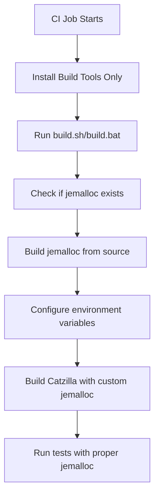

# Jemalloc CI Integration Fixes

## Problem Summary

The GitHub Actions CI workflow was failing due to conflicts between system-installed jemalloc packages and custom jemalloc build scripts. This created multiple issues:

1. **Build Script Conflicts**: CI was installing jemalloc via package managers (`apt-get`, `brew`) while build scripts expected to compile jemalloc from source
2. **Hardcoded Library Paths**: CI used hardcoded `LD_PRELOAD` paths that pointed to system jemalloc libraries
3. **Inconsistent Environments**: Different build environments (system vs. custom builds) caused unpredictable behavior

## Root Cause Analysis

### System Package Manager Installations
The CI workflows were installing jemalloc via:
- **Linux**: `sudo apt-get install -y libjemalloc-dev libjemalloc2`
- **macOS**: `brew install jemalloc`
- **Windows**: No system installation (correct)

### Build Script Detection Logic
The custom build scripts (`build_jemalloc.sh`, `build_jemalloc.bat`) include detection logic that skips building jemalloc if it's already installed. This caused them to skip the custom build when system packages were present.

### Hardcoded Library Paths
CI workflows used hardcoded paths like:
```bash
export LD_PRELOAD=/lib/x86_64-linux-gnu/libjemalloc.so.2:$LD_PRELOAD
```

## Solution Implementation

### 1. Removed System Jemalloc Installations

**Files Modified:**
- `.github/workflows/ci.yml`
- `.github/workflows/docs.yml`
- `.github/workflows/release.yml`

**Changes:**
- **Before**: `sudo apt-get install -y cmake build-essential libjemalloc-dev libjemalloc2`
- **After**: `sudo apt-get install -y cmake build-essential`

- **Before**: `brew install cmake jemalloc autoconf automake libtool`
- **After**: `brew install cmake autoconf automake libtool`

### 2. Removed Hardcoded LD_PRELOAD References

Removed all hardcoded `LD_PRELOAD` exports that pointed to system jemalloc libraries. The build scripts now handle jemalloc detection and loading automatically.

**Removed from CI:**
```bash
export LD_PRELOAD=/lib/x86_64-linux-gnu/libjemalloc.so.2:$LD_PRELOAD
```

### 3. Trust Build Script Automation

The build scripts (`build.sh`, `build.bat`) now handle:
- Detecting existing jemalloc installations
- Building jemalloc from source when needed
- Setting up proper library paths and environment variables
- Configuring `LD_PRELOAD` automatically via `jemalloc_helper.py`

## Build Dependencies Now Installed

### Linux (Ubuntu)
```bash
sudo apt-get update
sudo apt-get install -y cmake build-essential
```

### macOS
```bash
brew install cmake autoconf automake libtool
```

### Windows
```batch
choco install cmake --installargs 'ADD_CMAKE_TO_PATH=System'
```

## How Jemalloc is Now Handled

1. **Source-based Build**: Jemalloc is built from the git submodule at `deps/jemalloc/`
2. **Automatic Detection**: Build scripts detect if jemalloc needs to be built
3. **Environment Setup**: `jemalloc_helper.py` automatically configures library paths
4. **Cross-platform**: Same approach works on Linux, macOS, and Windows

## Build Script Workflow



## Benefits of This Approach

1. **Consistent Builds**: Same jemalloc version across all platforms
2. **No Version Conflicts**: Custom build ensures compatibility
3. **Simplified CI**: No platform-specific jemalloc setup required
4. **Better Control**: Full control over jemalloc configuration
5. **Easier Debugging**: Predictable jemalloc behavior

## Verification Steps

After these changes, CI should:

1. ✅ Install only essential build tools (cmake, build-essential, etc.)
2. ✅ Skip system jemalloc package installation
3. ✅ Let build scripts handle jemalloc compilation from source
4. ✅ Automatically configure library paths
5. ✅ Run all tests successfully with custom jemalloc

## Files Modified

- `.github/workflows/ci.yml` - Removed system jemalloc installations and hardcoded paths
- `.github/workflows/docs.yml` - Removed system jemalloc installation
- `.github/workflows/release.yml` - Removed system jemalloc installation
- `JEMALLOC_CI_FIXES.md` - This documentation

## Related Documentation

- `WINDOWS_BATCH_FIXES.md` - Windows batch script ANSI color fixes
- `WINDOWS_PYTHON_DEBUG_FIX.md` - Windows Python debug library fixes
- `scripts/jemalloc_helper.py` - Automatic jemalloc detection and setup
