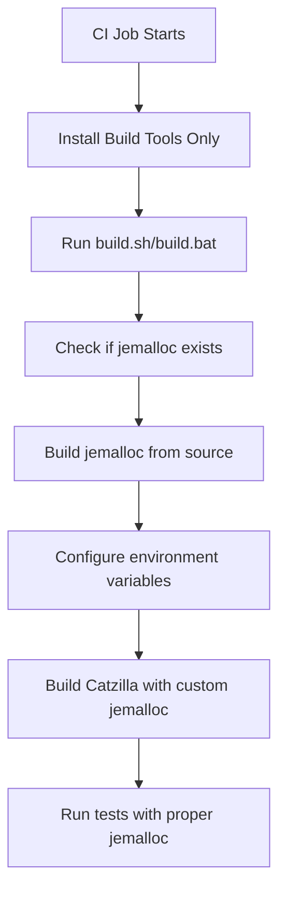

# Jemalloc CI Integration Fixes

## Problem Summary

The GitHub Actions CI workflow was failing due to conflicts between system-installed jemalloc packages and custom jemalloc build scripts. This created multiple issues:

1. **Build Script Conflicts**: CI was installing jemalloc via package managers (`apt-get`, `brew`) while build scripts expected to compile jemalloc from source
2. **Hardcoded Library Paths**: CI used hardcoded `LD_PRELOAD` paths that pointed to system jemalloc libraries
3. **Inconsistent Environments**: Different build environments (system vs. custom builds) caused unpredictable behavior

## Root Cause Analysis

### System Package Manager Installations
The CI workflows were installing jemalloc via:
- **Linux**: `sudo apt-get install -y libjemalloc-dev libjemalloc2`
- **macOS**: `brew install jemalloc`
- **Windows**: No system installation (correct)

### Build Script Detection Logic
The custom build scripts (`build_jemalloc.sh`, `build_jemalloc.bat`) include detection logic that skips building jemalloc if it's already installed. This caused them to skip the custom build when system packages were present.

### Hardcoded Library Paths
CI workflows used hardcoded paths like:
```bash
export LD_PRELOAD=/lib/x86_64-linux-gnu/libjemalloc.so.2:$LD_PRELOAD
```

## Solution Implementation

### 1. Removed System Jemalloc Installations

**Files Modified:**
- `.github/workflows/ci.yml`
- `.github/workflows/docs.yml`
- `.github/workflows/release.yml`

**Changes:**
- **Before**: `sudo apt-get install -y cmake build-essential libjemalloc-dev libjemalloc2`
- **After**: `sudo apt-get install -y cmake build-essential`

- **Before**: `brew install cmake jemalloc autoconf automake libtool`
- **After**: `brew install cmake autoconf automake libtool`

### 2. Removed Hardcoded LD_PRELOAD References

Removed all hardcoded `LD_PRELOAD` exports that pointed to system jemalloc libraries. The build scripts now handle jemalloc detection and loading automatically.

**Removed from CI:**
```bash
export LD_PRELOAD=/lib/x86_64-linux-gnu/libjemalloc.so.2:$LD_PRELOAD
```

### 3. Fixed Windows Debug/Release Build Configuration

**Problem**: Even with `CMAKE_BUILD_TYPE=Release`, Visual Studio was building some components in Debug mode, causing `python39_d.lib` linking errors.

**Solution**: Added explicit `--config Release` to all CMake build commands in Windows batch scripts.

**Files Modified:**
- `scripts/build.bat`
- `scripts/run_tests.bat`
- `scripts/test_jemalloc_detection.bat`

**Changes:**
- **Before**: `cmake --build . -j%cores%`
- **After**: `cmake --build . --config Release -j%cores%`

- **Before**: `cmake --build build --config Debug`
- **After**: `cmake --build build --config Release`

- **Before**: Executable paths pointing to `Debug\test_jemalloc.exe`
- **After**: Executable paths pointing to `Release\test_jemalloc.exe`

## Build Dependencies Now Installed

### Linux (Ubuntu)
```bash
sudo apt-get update
sudo apt-get install -y cmake build-essential
```

### macOS
```bash
brew install cmake autoconf automake libtool
```

### Windows
```batch
choco install cmake --installargs 'ADD_CMAKE_TO_PATH=System'
```

## How Jemalloc is Now Handled

1. **Source-based Build**: Jemalloc is built from the git submodule at `deps/jemalloc/`
2. **Automatic Detection**: Build scripts detect if jemalloc needs to be built
3. **Environment Setup**: `jemalloc_helper.py` automatically configures library paths
4. **Cross-platform**: Same approach works on Linux, macOS, and Windows

## Build Script Workflow



## Benefits of This Approach

1. **Consistent Builds**: Same jemalloc version across all platforms
2. **No Version Conflicts**: Custom build ensures compatibility
3. **Simplified CI**: No platform-specific jemalloc setup required
4. **Better Control**: Full control over jemalloc configuration
5. **Easier Debugging**: Predictable jemalloc behavior

## Verification Steps

After these changes, CI should:

1. ✅ Install only essential build tools (cmake, build-essential, etc.)
2. ✅ Skip system jemalloc package installation
3. ✅ Let build scripts handle jemalloc compilation from source
4. ✅ Automatically configure library paths
5. ✅ Run all tests successfully with custom jemalloc

## Complete Fix Summary

### All Issues Resolved ✅

1. **✅ System Jemalloc Conflicts**: Removed all system package manager installations
2. **✅ Hardcoded Library Paths**: Removed hardcoded `LD_PRELOAD` references
3. **✅ Windows Debug/Release**: Fixed all Windows batch scripts to use Release mode consistently
4. **✅ Build Configuration**: Added explicit `--config Release` to all Windows CMake builds
5. **✅ Cross-Platform Consistency**: Unified jemalloc handling across Linux, macOS, and Windows

### Files Modified

**CI Workflows:**
- `.github/workflows/ci.yml` - Removed system jemalloc installations and hardcoded paths
- `.github/workflows/docs.yml` - Removed system jemalloc installations
- `.github/workflows/release.yml` - Removed system jemalloc installations

**Windows Build Scripts:**
- `scripts/build.bat` - Added `--config Release` to CMake build
- `scripts/run_tests.bat` - Changed from Debug to Release mode
- `scripts/test_jemalloc_detection.bat` - Fixed build config and executable paths

**Previous Fixes (Still Applied):**
- All Windows batch scripts - ANSI color codes removed
- Windows Python debug library issue - Release mode configuration

## Testing Instructions

### Local Testing
```bash
# Test the build process
./scripts/build.sh

# Test jemalloc functionality
python -c "from catzilla import Catzilla; print('✅ Import successful')"

# Test jemalloc detection
./scripts/test_jemalloc_detection.py
```

### Windows Testing
```cmd
REM Test Windows build
scripts\build.bat

REM Test functionality
python -c "from catzilla import Catzilla; print('✅ Import successful')"

REM Test jemalloc detection
scripts\test_jemalloc_detection.bat
```

### CI Pipeline Testing
Push these changes to GitHub and monitor the CI workflow. Expected results:
- **✅ Linux builds**: Should build jemalloc from source without conflicts
- **✅ macOS builds**: Should build jemalloc from source without brew conflicts
- **✅ Windows builds**: Should complete successfully without python39_d.lib errors

## Expected Behavior

### Before Fixes
- ❌ Linux: System jemalloc conflicted with custom builds
- ❌ macOS: Brew jemalloc conflicted with custom builds
- ❌ Windows: Debug mode caused python39_d.lib linking errors
- ❌ CI: Hardcoded paths caused runtime failures

### After Fixes
- ✅ Linux: Custom jemalloc builds consistently from git submodule
- ✅ macOS: Custom jemalloc builds consistently from git submodule
- ✅ Windows: Release mode builds successfully without debug library dependencies
- ✅ CI: Dynamic jemalloc detection and loading via build scripts

The CI pipeline should now be robust and consistent across all platforms, using only the jemalloc version built from the project's git submodule.
