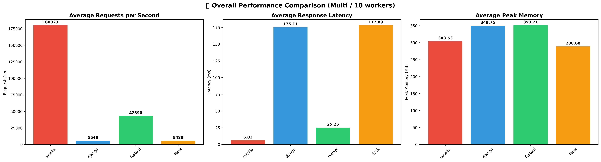
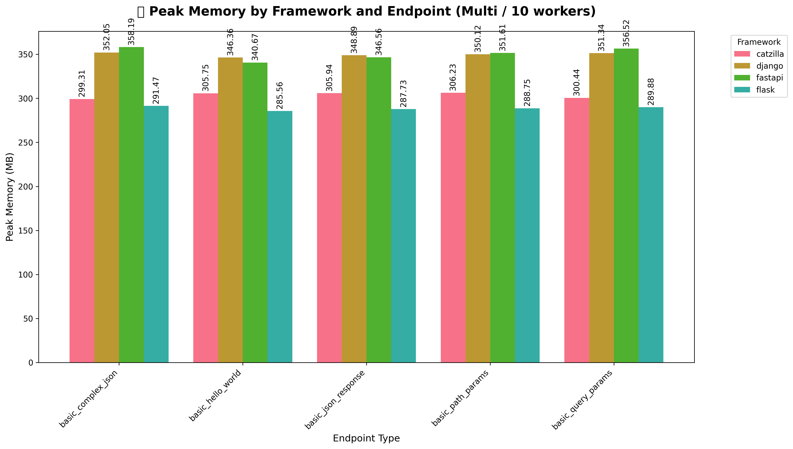
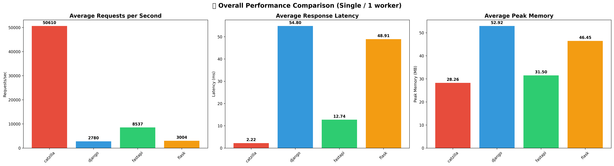
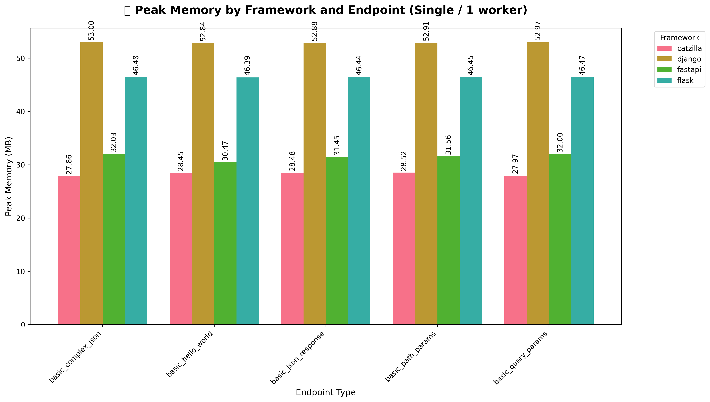

# 🚀 Catzilla Framework - Transparent Performance Report
Generated: 2026-05-09 12:38:47

## 📋 Executive Summary

This report provides a transparent, feature-by-feature comparison of Catzilla
against leading Python web frameworks (FastAPI, Flask, Django).

- **Total Benchmarks**: 40
- **Frameworks Tested**: catzilla, django, fastapi, flask
- **Feature Categories**: 1
- **Worker Configurations**: Multi / 10 workers, Single / 1 worker

## 🏁 Benchmark Highlights

Catzilla is built to be the **world's fastest Python web framework**.
In the benchmark suite in this repository, it leads FastAPI, Flask, and Django in both single-worker and 10-worker direct HTTP benchmarks.

### Multi / 10 workers

- **Catzilla Avg RPS**: 180023
- **Catzilla Best Endpoint**: basic_hello_world (212426 RPS)
- **Catzilla Avg Latency**: 6.03ms
- **Catzilla Avg Peak Memory**: 303.53MB
- **Lead over Fastapi**: 4.2x average throughput

### Single / 1 worker

- **Catzilla Avg RPS**: 50610
- **Catzilla Best Endpoint**: basic_hello_world (72249 RPS)
- **Catzilla Avg Latency**: 2.22ms
- **Catzilla Avg Peak Memory**: 28.26MB
- **Lead over Fastapi**: 5.9x average throughput

## 🎯 Feature-by-Feature Analysis

### Basic

| Framework | Avg RPS | Max RPS | Avg Latency (ms) | Min Latency (ms) | Avg Peak Memory (MB) | Max Peak Memory (MB) |
|-----------|---------|---------|------------------|------------------|----------------------|----------------------|
| Catzilla | 115316 | 212426 | 4.12 | 1.41 | 165.90 | 306.23 |
| Django | 4164 | 5623 | 114.96 | 51.90 | 201.34 | 352.05 |
| Fastapi | 25713 | 55122 | 19.00 | 8.98 | 191.11 | 358.19 |
| Flask | 4246 | 5537 | 113.40 | 45.41 | 167.56 | 291.47 |

**Catzilla Performance Advantage:**

- **2669.2% faster** than Django
- **348.5% faster** than Fastapi
- **2615.9% faster** than Flask

## 🏆 Top Performers by Category

- **Basic**: Catzilla (212426 RPS)

## 📊 Visualization Files

The following charts have been generated for detailed analysis:

### Overall Performance
- `overall_multi_10w_requests_per_second.png` - Overall RPS comparison (Multi / 10 workers)
- `overall_multi_10w_latency_comparison.png` - Overall latency comparison (Multi / 10 workers)
- `overall_multi_10w_memory_comparison.png` - Overall peak memory comparison (Multi / 10 workers)
- `overall_multi_10w_performance_summary.png` - Performance summary charts (Multi / 10 workers)
- `overall_multi_10w_performance_heatmap.png` - Performance heatmap (Multi / 10 workers)
- `overall_single_1w_requests_per_second.png` - Overall RPS comparison (Single / 1 worker)
- `overall_single_1w_latency_comparison.png` - Overall latency comparison (Single / 1 worker)
- `overall_single_1w_memory_comparison.png` - Overall peak memory comparison (Single / 1 worker)
- `overall_single_1w_performance_summary.png` - Performance summary charts (Single / 1 worker)
- `overall_single_1w_performance_heatmap.png` - Performance heatmap (Single / 1 worker)

### Category-Specific Analysis
- `basic_multi_10w_performance_analysis.png` - Basic detailed analysis (Multi / 10 workers)
- `basic_single_1w_performance_analysis.png` - Basic detailed analysis (Single / 1 worker)

---
*This report is automatically generated by the Catzilla Transparent Benchmarking System*